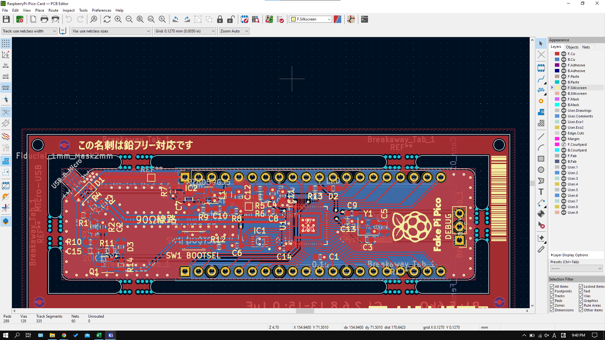

# RaspberryPi-Pico-Card [ラズパイ名刺]
RP2040搭載の汎用名刺です。ラズベリーパイPicoとピン互換性があります。

KiCad6のプロジェクトテンプレートを載せておいたので参考にどうぞ

回路ミスなど問題報告は次のTwitterアカ(@nihon_niosumai)まで

[誤植]2022/10/18  裏面の部品リストでIC1とIC2が同一になっている誤植がありました。正しくはIC1はW25Q16JVUXIQです。v1を受け取った方、すみません、

この名刺の使用によって何らかの問題が生じても設計者やえはいかなる責任も負いかねます。
